# springbootA367
springbootA367酒店公寓民宿宾馆客房预定管理系统LW
 
## 查看主页获取源码

### 一、关键词

酒店、公寓、民宿、宾馆、长租公寓、短租民宿、精品酒店、服务式公寓

### 二、作品包含

源码+数据库+万字文档+全套环境和工具资源+部署教程

### 三、项目技术

前端技术：Html、Css、Js、Vue2.0、Element-ui 
数据库：MySQL
后端技术：Java、SpringBoot2.0、MyBatis

  

### 四、运行环境

开发工具：IDEA/eclipse  + vscode

数据库：MySQL5.7（最低要5.7版本）

数据库管理工具：Navicat10以上版本

环境配置软件： JDK1.8 + Maven3.6.3

前端Nodejs：16

浏览器：谷歌浏览器

### 五、项目介绍

项目编号：springbootA367

酒店管理系统主要是借助计算机，通过对信息进行管理。减少管理员的工作，同时也方便广大用户对个人所需酒店信息及时查询。

功能介绍：
①：用户模块：用户登录、注册、预约住房、留言、查看公告、查看预约、入住查询

②：管理员模块：统计图表、管理员管理、用户管理、房型管理、房间管理、预约管理、入住管理、留言管理、公告管理。

### 六、运行截图

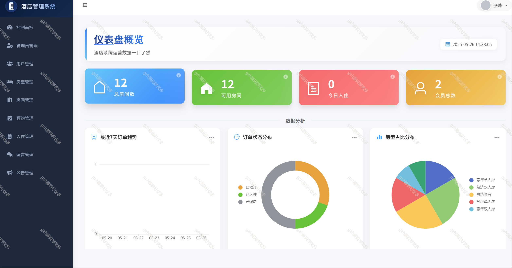
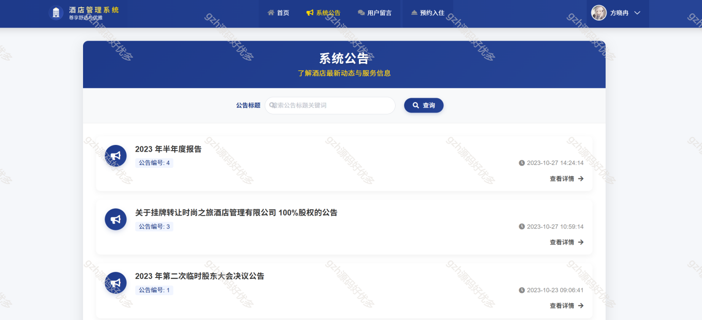
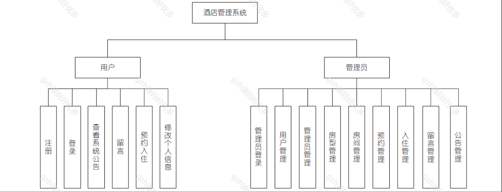
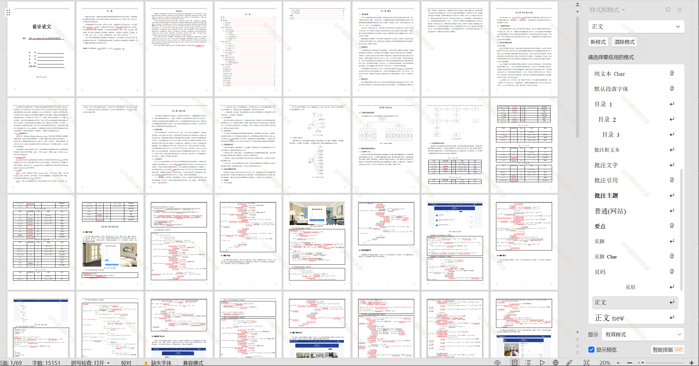
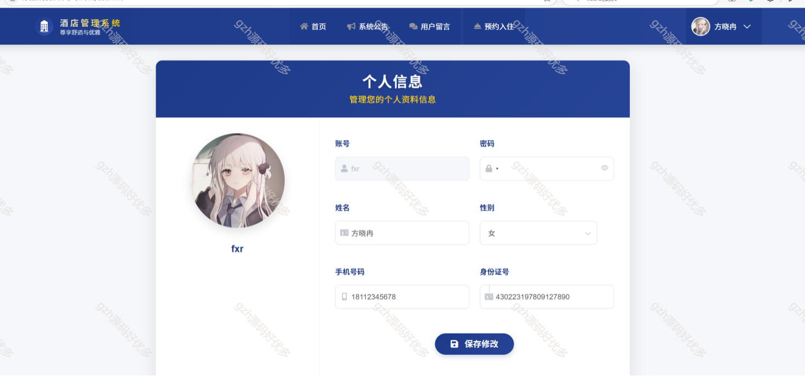
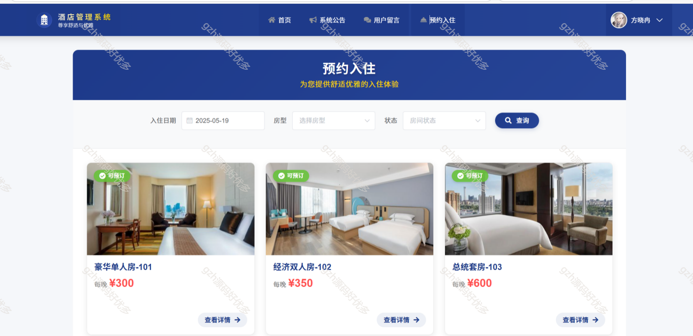
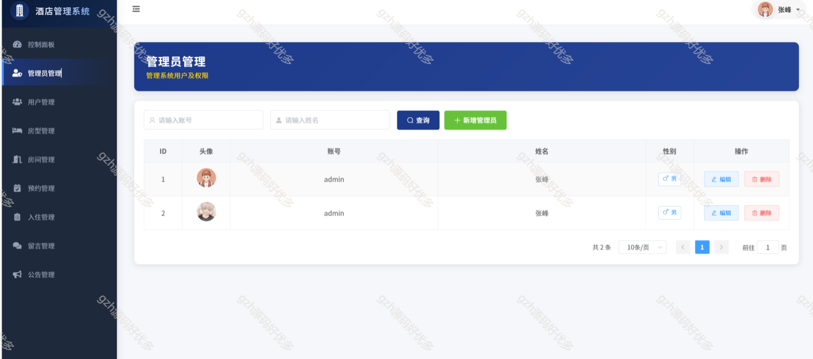
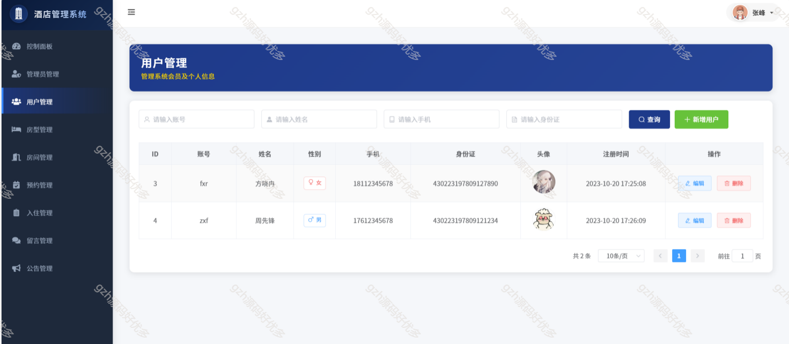
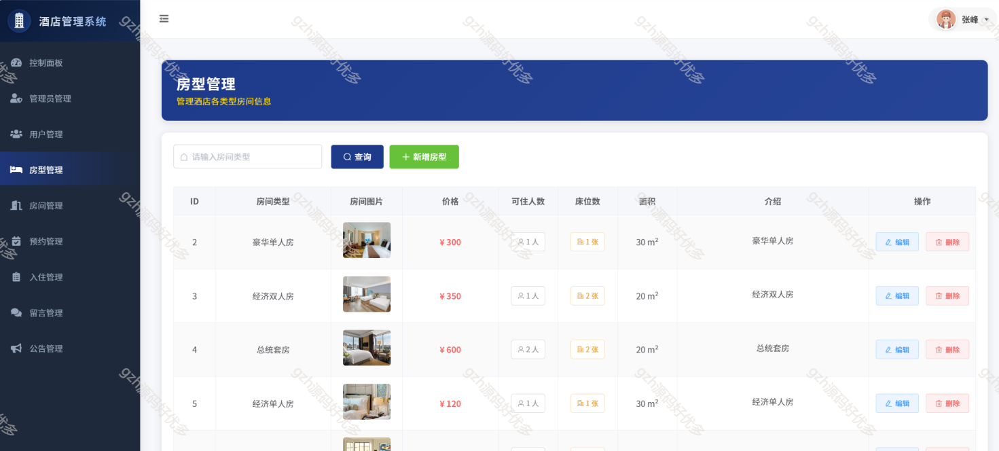
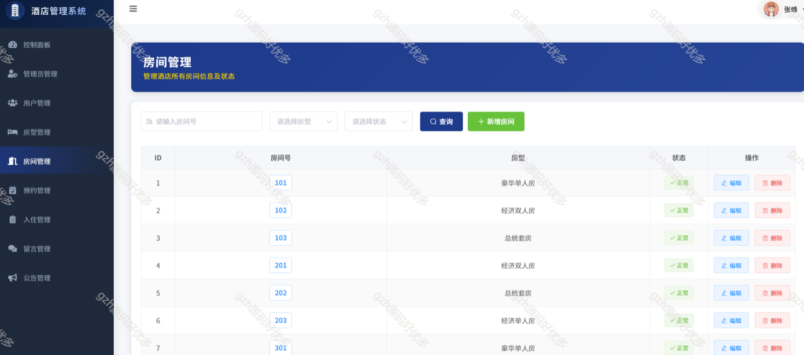
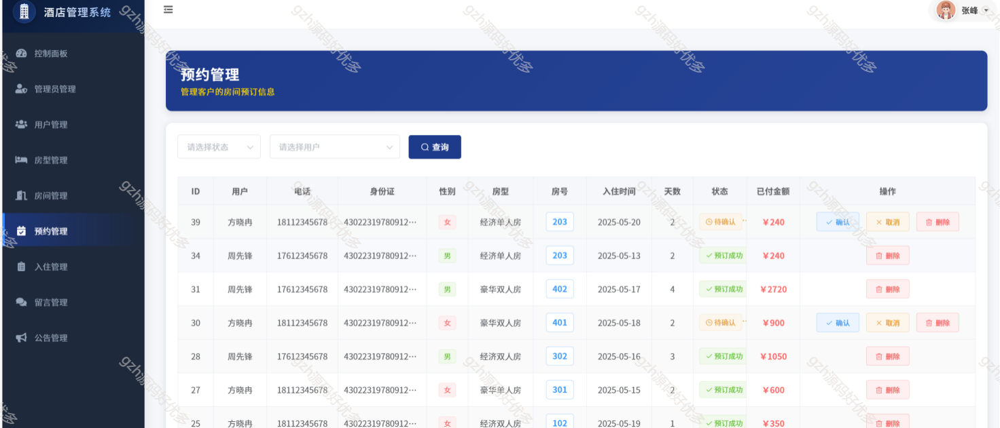
